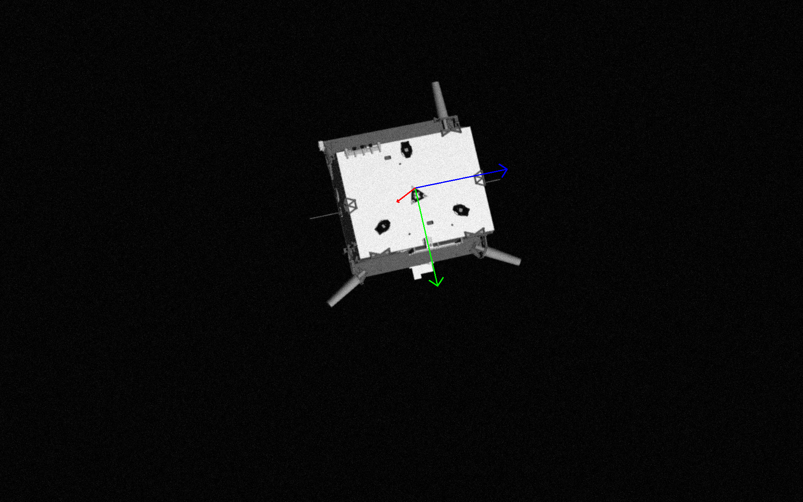
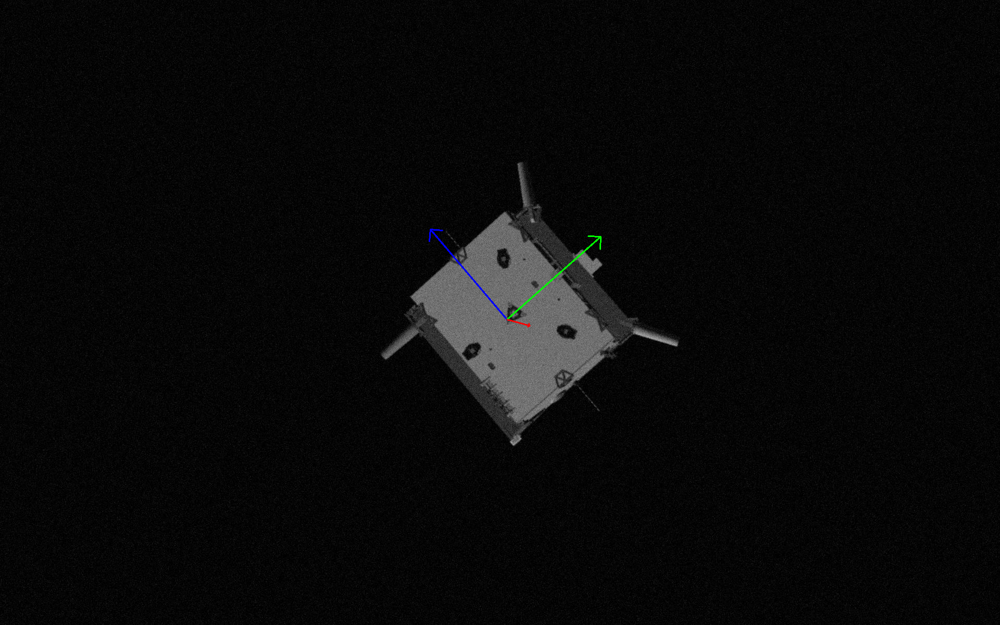

# View Synthesis for Space in Python.
This repository contains the Python implementation of the project VISY-REVE of Marius Neuhalfen. The accompanying paper can be found here: [https://arxiv.org/abs/2507.02993v1](https://arxiv.org/abs/2507.02993v1).

## How-To

Use the notebook `get_started.ipynb` to get started.

The code has been written in an object-oriented way to favor easy usability and extendability. If you want to contribute, feel free to open a pull-request.

## Demo Video

Watch a demonstration of the view synthesis process:

## Use-cases

Our pipeline offers running **closed-loop, real-time** validation of image processing for Vision-Based Navigation from **sparse** datasets. This is a large step-up from existing rendering or laboratory acquisition methods for closed-loop.

Below you can see the result of a keypoint detection and PnP algorithm for pose estimation running on a synthesized trajectory, the errors are in the same order of magnitude as the errors on the real imagery.

<em>Trajectories: blue real, red synthesized</em>

<em>PnP pose estimation errors</em>

## Supported datasets

### SPEED+

We support the OG-SPEED+ dataset from Stanford-SLAB and ESA's ACT. Since the ground truth format and 3D model are the same for the original SPEED and SHIRT datasets they are also automatically supported. The 3D model can be found here: [https://github.com/marius-ne/Tango3DModel/tree/main](LINK).

[1] Tae Ha Park, Marcus Märtens, Gurvan Lecuyer, Dario Izzo, and Simone D’Amico. Speed+: Next-generation dataset for
spacecraft pose estimation across domain gap. 10 2021

### ESA-AIRBUS

[2] Jérémy Lebreton, Ingo Ahrns, Roland Brochard, Christoph Haskamp, Matthieu Le Goff, Nicolas Menga, Nicolas Ollagnier,
Ralf Regele, Francesco Capolupo, and Massimo Casasco. Training datasets generation for machine learning: Application to
vision based navigation. 9 2024

### SWISSCUBE

[3] Yinlin Hu, Sebastien Speierer, Wenzel Jakob, Pascal Fua, and Mathieu Salzmann. Wide-depth-range 6d object pose estimation
in space. 4 2021

## Transforms

### Homography

Source view.

Target view.

Synthesized view.

Blend of synthesized and target views.

### 3D Transform

Source view.

Target view.

Synthesized view.

Blend of synthesized and target views.

## Background processing

We also propose synthesizing new coherent backgrounds for novel views which are important for challenging the training process.

### OOFA inpainting
We propose an algorithm for inpainting OOFAs caused by the transform.
#### Cutting and glueing
Here you can see the naive result of performing a projective transform.

We first choose the largest inscribed rectangle (LIR) in the background.

We then cut the OOFAs into regions smaller than the LIR (edges here enlargened for easier visibility, in reality only 1 pixel wide).

Lastly we randomly choose subregions of the LIR and add them to the OOFAs. We also apply the NS algorithm to inpaint the edges to smooth the transition, also this could still be improved.

